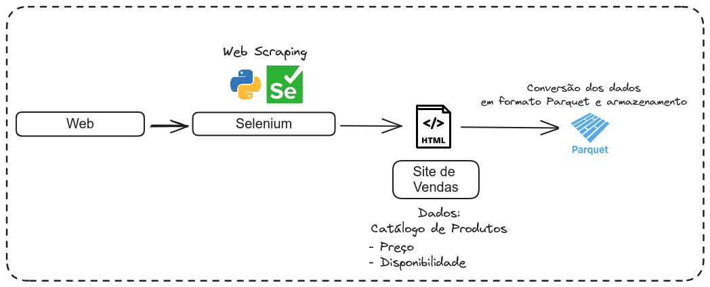
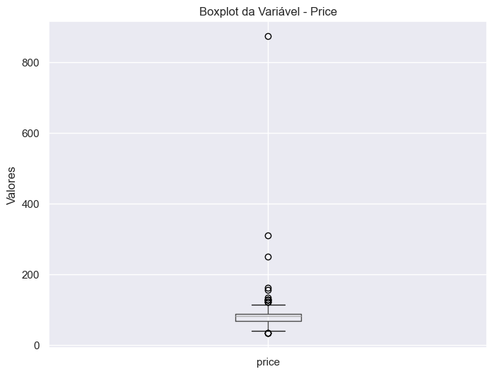
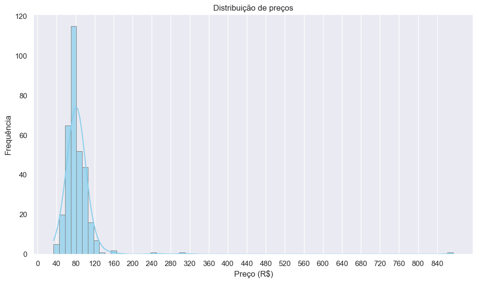

# K7-Cassette-Music-Catalogue-Scraping
Scraping data from a website that heavily uses javascript with Selenium.

The eda is located at eda.py
The webcraping steps are located in main.py

#### Boxplot

##### Variabilidade e Distribuição
- A variável preço possui parte dos valores concentrados à esquerda (próximo de R$ 85), no entanto, também há uma minoria de produtos listados com valores altos (R$ 160 ou mais).

##### Outliers
- Há produtos listados no formato pack (pacotes c/ mais de 1 item) e itens de edição limitada.

##### Concentração dos dados
- A linha central do box-plot (mediana) está próxima de R$ 80, ou seja, 50% dos produtos estão listados acima, desse valor, e 50% estão listados abaixo.

#### Histograma

- Nota-se que boa parte dos dados estão concentrados à esquerda, e apresenta um pico de frequência próximo de R$ 80.

#### Describe info
Total de Produtos: 330
Média de Preço: R$ 85.31
Mediana de Preço: R$ 80.90
Preço Mínimo: R$ 33.90
Preço Máximo: R$ 873.90